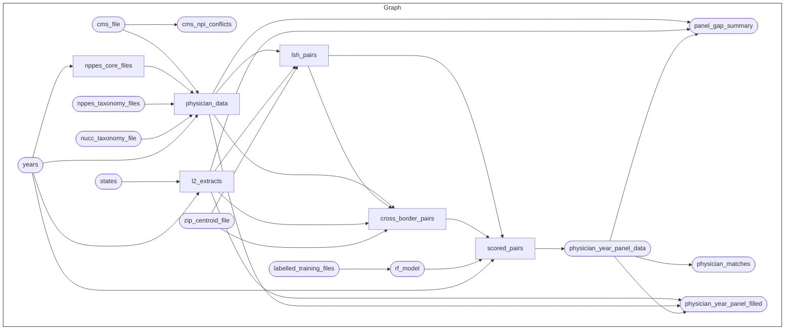

# Dependency Graph

Generated from `_targets.R`, so it is accurate as of the commit you are reading. Regenerate it
after changing the graph:

```r
m <- targets::tar_mermaid(targets_only = TRUE, legend = FALSE)
m <- gsub(":::[a-zA-Z]+", "", m)
writeLines(m[!grepl("classDef|linkStyle", m)], "docs/_graph.mmd")
```

Then paste the contents into the fence below. Build status is deliberately stripped — the
diagram describes structure, not whether one machine happens to be up to date.

Rounded nodes are single targets; square nodes are dynamically branched, one instance per
state-year or per year.



For an interactive version, with build status, run `targets::tar_visnetwork()` locally.
