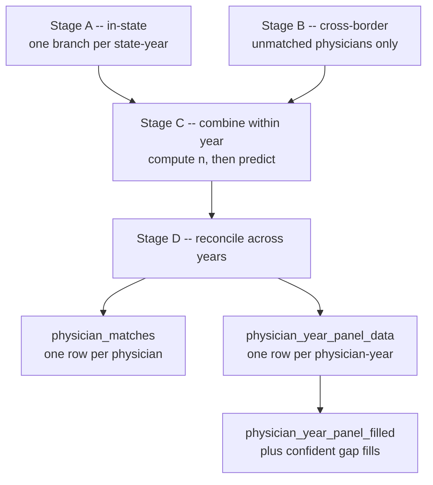

# Methodology

How a physician record is linked to a voter record, and why each choice was made.

!!! note "No performance numbers yet"

    Nothing in this pipeline has been run against real L2 data. Every claim below is about
    what the code does and why, not about how well it does it. Precision, recall and the
    behaviour of the four tuning thresholds are all unmeasured — see
    [What is not yet known](#what-is-not-yet-known).

## The shape of the problem

There is no shared identifier between NPPES and the L2 voter file. A physician must be
matched to a voter on name, address and demographics, none of which is unique. Comparing
every physician to every voter is infeasible — roughly 10⁶ physicians against 10⁸ voters — so
matching is two steps:

1. **Blocking.** Cheaply generate a small set of *candidate* pairs that might match.
2. **Classification.** Score each candidate with a model trained on hand-labelled pairs.

## Blocking: locality-sensitive hashing

Candidate pairs come from [zoomerjoin](https://github.com/beniaminogreen/zoomerjoin), which
implements MinHash LSH over character n-grams of the name. Two joins run per partition and
their results are unioned:

| Join | Key | Blocked on |
| --- | --- | --- |
| 1 | first + middle + last name | nothing |
| 2 | first + last name | middle initial |

The second join exists because middle names are recorded inconsistently: a physician listed
as "Jane Q Smith" and a voter listed as "Jane Smith" will not clear a similarity threshold on
the full name. It is post-filtered to pairs where at least one side has only an initial or
nothing, so pairs that *both* carry a full middle name are left to join 1.

Neither join blocks on state, because the pipeline runs one partition per state-year — the
partition *is* the block. Join 2 keeps `block_by = "mi"` anyway, since that carries a
middle-initial **agreement** requirement that dropping it would silently discard.

LSH admits a pair when estimated Jaccard similarity on 3-grams clears `threshold = 0.7`. This
is a recall/compute dial, not a match criterion: it decides what the model gets to look at.
Lowering it produces more candidates and more compute; raising it risks discarding true
matches before the model ever sees them.

## Features

Eight features are computed per candidate pair and fed to the model:

| Feature | What it measures |
| --- | --- |
| `full_name_sim` | Jaccard similarity of the full names, 3-grams |
| `mid_name_agree` | Jaccard similarity of the middle names, **2**-grams |
| `mid_initial_agree` | do the middle initials match |
| `zip_dist` | great-circle miles between practice ZIP and residence ZIP |
| `year_dist` | medical-school graduation year minus voter birth year |
| `n` | how many candidate voters this physician has |
| `occ_medical` | is the voter's commercial occupation a medical one |
| `occ_unknown` | is it missing or recorded as `"Unknown"` |

Three of these deserve explanation.

**`mid_name_agree` uses 2-grams while every other name comparison uses 3.** Middle names are
short enough that 3-grams are too coarse. This is deliberate.

**`n` is a proxy for name commonness.** A physician with forty candidate voters is probably
named John Smith, and any single one of those candidates is correspondingly less likely to be
the right person. It is computed once per year over *both* matching passes, not per partition,
so that it means the same thing everywhere.

**Occupation enters as two indicators, not one.** A single "is medical" flag would fold
missing occupations in with genuinely non-medical ones, because a missing value is not a
match for `"Medical"`. L2's commercial occupation data is sparse, so that case is common
rather than marginal. The pair distinguishes three states:

| Occupation value | `occ_medical` | `occ_unknown` | Reads as |
| --- | --- | --- | --- |
| `Medical-Physician`, `Medical-Nurse`, … | 1 | 0 | evidence for |
| `Educator`, any other known value | 0 | 0 | evidence against |
| `Unknown` or missing | 0 | 1 | uninformative |

### Why `state_agree` is not a feature

Whether a pair crosses a state line is computed and carried through to the output, but is
deliberately **not** given to the model.

A state line is an artifact of how the data is partitioned, not a barrier to commuting.
`zip_dist` already measures the thing that matters, and measures it continuously — a
physician living 15 miles away across a border is nearer than one living 60 miles away
in-state, and the model should treat them accordingly.

This also lets the model score cross-border pairs without new labels. The training data is
same-state only, but intra-state distances in large states run to hundreds of miles, so a
67-mile cross-border pair sits well inside the `zip_dist` range the model already learned
from — it simply learned it from Texas rather than from a border crossing.

## The model

A `grf::probability_forest()` — a random forest that outputs a calibrated probability rather
than a bare class. Trained once on hand- and rule-labelled 2018 pairs and reused for every
year.

Output is `match_prob`, deliberately *not* named `match`: `match` is the training **label**
column, and keeping the names distinct means a scored dataset can never be mistaken for a
labelled one.

!!! warning "The model assumes feature stability across years"

    The labelled data is 2018-only. Reusing the fit for 2019–2025 assumes the feature
    distribution does not drift, which is untested and which nothing in the pipeline detects.
    If later years look odd, check this first.

## The four stages

### Stage A — within state-year

Every physician is matched against the voter file of their own practice state, one branch per
state-year. This is where the great majority of matches are found.

### Stage B — across state lines

Physicians who practise in one state and live in another are missed by Stage A. DC is the
extreme case: a physician practising in DC very likely lives in Maryland or Virginia.

Stage B retries a physician against the voter files of bordering states, using a hand-built
adjacency table. Adjacency is a proxy for "could plausibly commute", not a statement of
geography — land borders are in, water-only borders are out, and Four Corners point contacts
are in because including them costs nothing.

**Who gets retried** is the interesting part. A physician is exempted only when Stage A found
them **exactly one** candidate at or above a strong name-similarity threshold. Zero
candidates, or two or more, both mean retry.

Requiring *uniqueness* rather than just a high maximum is what closes the common-name hole: a
dozen in-state voters all scoring 0.99 is evidence of a common name, not of a match.

The rule is deliberately model-free. Defining it by `match_prob` would be circular, because
`n` — and therefore the prediction — is only correct once a year's states are combined, which
happens downstream.

### Stage C — combine within a year

Both passes are unioned per year, `n` is computed over the combined set, and the model
predicts. Per year rather than all at once because the model needs a materialised matrix and
eight years of national candidate pairs will not fit in memory.

### Stage D — reconcile across years

Two outputs. `physician_year_panel_data` keeps one row per physician-year — that year's best
voter. `physician_matches` reduces to one row per physician: the best match in any year.

Ties are **kept and flagged**, not dropped, and there are two kinds. `any_tied_in_year` marks
two candidates tied within a year. `best_is_tied` marks two or more *distinct voters* tied for
a physician's overall best, possibly in different years — which the per-year flag cannot see.
It counts distinct voters rather than rows, because the same voter matching equally well in
several years is the common, unambiguous case.

`physician_matches` still emits exactly one row per physician; the tie is broken
deterministically, which is arbitrary but reproducible.

!!! note "`mover` means less than it sounds like"

    `mover` is TRUE when a physician's best-matching voter is not the same in every year. That
    is consistent with a genuine move, and equally consistent with two similar voters trading
    places because of scoring noise. It is a flag to investigate, not a finding.

## Gap filling

A physician can hold an NPI in a year and have no matched voter. `physician_year_panel_filled`
adds a row for such gaps where the identity can be carried across confidently, leaving the
unfilled panel untouched so nothing downstream sees imputed rows by accident.

Four gates must all hold, and a missing value fails every one of them: a strongly-matched
anchor year exists, the anchor years point to exactly one voter, the practice state is stable
between the gap year and the anchors, and the anchor's `zip_dist` is small.

`fill_tier` then records *why* the year was empty:

| Tier | Meaning | Confidence |
| --- | --- | --- |
| 1 | no L2 data existed for that state-year (2024 MD/MS/NV) | highest — matching was impossible, so absence says nothing about the physician |
| 2 | L2 existed and the physician was not matched | weaker — absence is evidence, though ambiguous |
| 3 | gates not met | not filled |

Both tiers apply the same gates. Tier 2 is weaker because there is counter-evidence, not
because it was checked less carefully.

**Movers are never filled**, because the "exactly one voter" gate fails for them by
construction. Picking one of two records to carry across a gap would be a guess dressed as
data.

**Filled rows carry an identity and nothing else.** `match_prob`, `zip_dist`, `full_name_sim`,
`n` and the tie flags are all missing, because there is no model output for a year that was
never scored. Copying the anchor year's values in would invent a measurement.

!!! danger "What a fill does and does not license"

    A fill asserts *this physician is this voter*, extended to a year where that was not
    observed.

    - **Safe** for appending time-invariant voter attributes — birth date, place of birth,
      race/ethnicity.
    - **Unsafe wherever registration or turnout is the outcome.** In Tier 2 especially, the
      physician's absence may *be* the finding: they might genuinely not have been registered
      that year. Filling it and then asking "were they registered?" answers the question with
      the assumption.

    Filter on `filled` or `fill_tier` accordingly.

## Physician side

One table per year, from four sources:

| Source | Varies by year? | Provides |
| --- | --- | --- |
| NBER `core` | **yes** | names, practice and mailing addresses |
| NBER `ptaxcode` | no (four extracts unioned) | primary taxonomy code |
| NUCC crosswalk | no | taxonomy grouping, used to filter to physicians |
| CMS "Doctors and Clinicians" | no | graduation year, medical school |

Everything except the CMS file comes from one static archive at `data.nber.org`, deliberately:
CMS reorganises its download pages, NBER's tree does not.

**Address is the practice location**, falling back to the mailing address where practice is
missing, with `addr_source` recording which was used. Practice location is what `zip_dist` is
meant to measure distance from — a mailing address can be a billing office or a PO box.

**Taxonomy is unioned newest-first** across the four usable extracts, keeping the most recent
designation per NPI, so a provider who drops out mid-panel is still recovered. Only four of
eight years are usable, and that is the source's doing: 2018 publishes no taxonomy file, 2020
returns HTTP 403 for every format, and 2021/2022 are published without an NPI column. The
residual gap is an NPI that both appeared and disappeared strictly between December 2019 and
May 2023.

**An NPI with conflicting CMS records is dropped entirely** — a provider listed with two
graduation years cannot be resolved, and keeping one would fan that physician out through
every downstream join. `targets::tar_read(cms_npi_conflicts)` reports how much this costs.

Note the CMS file is the Medicare "Doctors and Clinicians" file, not NPPES. Consequently
graduation year — and so `year_dist` — is missing for any physician who does not bill
Medicare. That missingness tracks Medicare participation, not data quality.

## ZIP distance

`zip_dist` is a great-circle distance computed from Census ZCTA internal points, distributed
by NBER as a 890 KB centroid file.

NBER also publishes pre-computed distance files, which are not used. Every one of them is
capped at a radius (5, 25, 50, 100 or 500 miles), so pairs beyond the cap are simply absent —
which would conflate "far apart" with "no coordinate available". Computing directly means
`zip_dist` is missing for exactly one reason: the ZIP has no ZCTA, as PO-box-only ZIPs do not.

The computation reproduces NBER's published numbers to a maximum absolute error of 0.000035
miles across 50,000 sampled pairs.

## What is not yet known

Honest limitations, all of which require a real run to resolve:

- **No performance numbers at all.** No precision, no recall, no confusion matrix.
- **Four thresholds are set a priori** — the LSH threshold, the strong-match threshold that
  exempts a physician from Stage B, and the two gap-fill gates.
- **The model has not been retrained** since several features changed meaning: a name-handling
  fix, the two occupation indicators, a change in how `zip_dist` is computed, and the switch
  from mailing to practice address.
- **`n` partly encodes the Stage B selection rule.** Adding cross-border candidates raises `n`
  for retried physicians, which shifts the scores of their existing in-state candidates. So
  `n` is no longer purely a proxy for name commonness — some selection signal leaks in. This
  is inherent to combining a selection rule with a count-based feature.
- **Feature drift across years is undetected**, as noted above.
